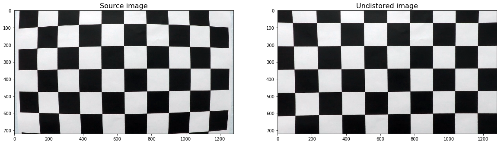
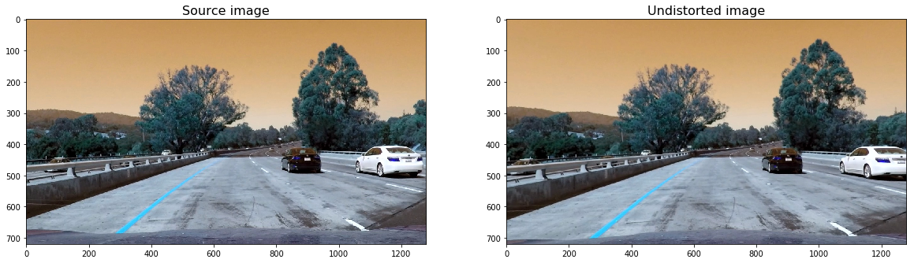
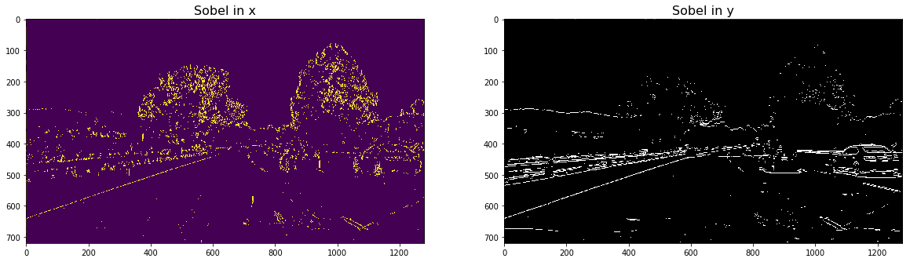
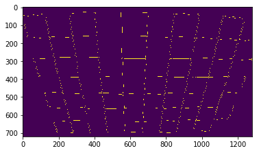
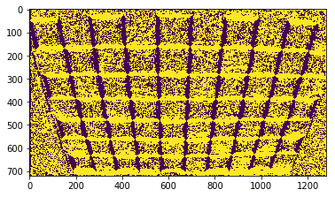
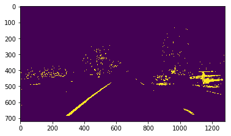
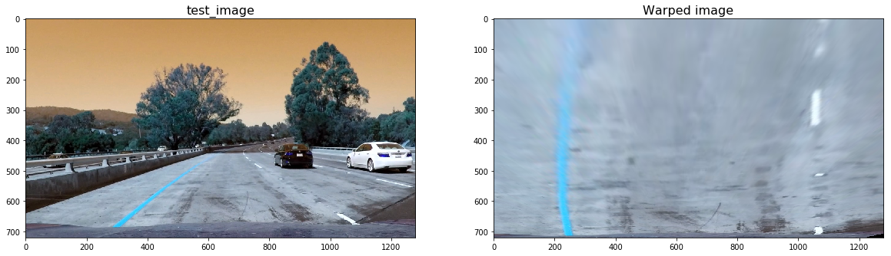
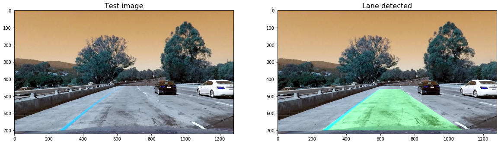

# Advanced Lane Finding

## Camera Calibration

we use chessboards to calibrate our camera. Chessboards are great for calibration because their general high contrast pattern, a
makes it easy to detect patterns. And since we know what an undistorted chessboard looks like. So using the chessboard images taken
from the camera and our known undistorted chessboard we can measure the distortion and use that to correct the images. We use a transform from 
cv2 to undistort the images.
we first read in the calibration images of the chessboard. Using the real coordinates of a  chessboard and store them in objpoints. We use a opencv function
to find the corners in the disorted images and store them all in imgpoints. We then use an in built function in opencv to find the camera coefficient matrices. 
These will then be used to undistort an image with another in built opencv function

And this is an example of using the calibration coefficients to a test image

## Pipeline (test images)

### Color transforms
In order to localize the lanes, it is important to remove as much noise as we can and detect the lines in the image. There are number of ways of removing noise from an image.
One of them is using the sobel operator in the x and y direction

Another is using the magnitude, which takes the gradient in x or y and sets the threshold to identify pixels within a
certain gradient range:

We can also use the direction of the gradient is simply the inverse tangent (arctangent) of the y gradient divided by the x gradient

we also threshold the image based on color:

Finally we use a combination of these thresholded image to obtain an image of the lines with much less noise

### Perspective transform
We can warp the images using perspective transform by identifying source points and where they should be mapped,
destination points. 

### Finding lane lines
In order to find lane lines we split our lane lines into windows and iterate through each window.
We then find the boundary of the window in question. We proceed to use cv2.rectangle to draw these window boundaries
into our image. We then find the activated pixels from nonzeroy and nonzerox and append these to left_land_inds and right_lane_inds.
If the number of pixels in nonzerox and nonzeroy aer greater than our hyperparameter minpix we recenter our windowbased
on mean position of these pixels. Finally we fit a polynomial to each line (left and right). Here is the image after
finding lane lines:

## Pipeline (video)

## Discussion